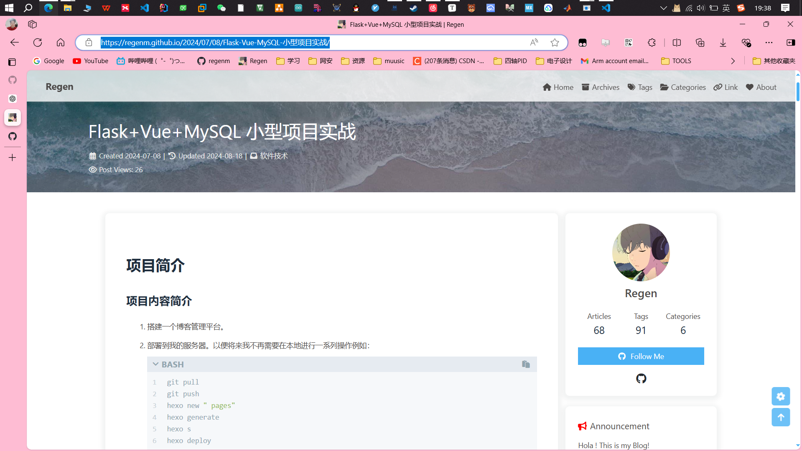
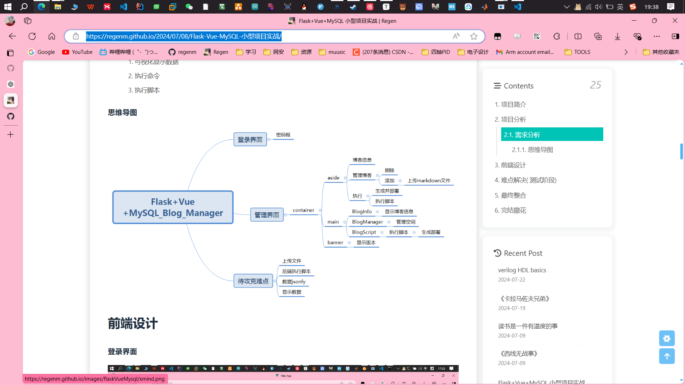

# hexoBlogManager

Flask + Vue  + python + shell help me manage my hexo Blog

[Flask+Vue+MySQL 小型项目实战 | Regen (regenm.github.io)](https://regenm.github.io/2024/07/08/Flask-Vue-MySQL-%E5%B0%8F%E5%9E%8B%E9%A1%B9%E7%9B%AE%E5%AE%9E%E6%88%98/)

